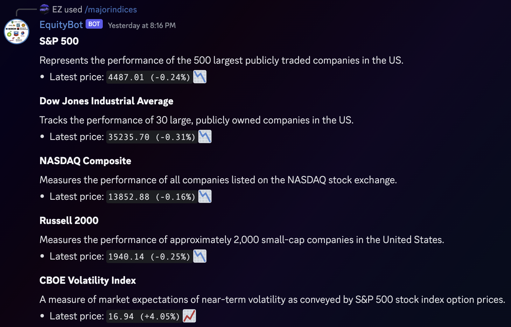

# discord-bot-cpp
Discord bot written in C++ with the [D++/DPP library](https://github.com/brainboxdotcc/DPP).  
It can fetch stock/future/index data and visualize it.  
All data is fetched from [Yahoo Finance](https://finance.yahoo.com).   
Important to note is that data may be delayed.

## Slash Commands (so far)
### /latestprice  
  - Fetches latest price data
  - Input: equity symbol


### /metrics  
  - Fetches equity metrics  
  - Input: equity symbol


### /majorindices
  - Fetches latest price data for certain major indices based on the given region  
  - Input: region (US/EU/Asia)



### /pricegraph 
  - Fetches price data and plots the open and/close price
  - Input: equity symbol, period (e.g. 6 months, 2 weeks, etc.), mode (only open/only close/both)


### /candlestick
  - Fetches OHLC data and creates a candlestick chart, optionally with volumes
  - Input: equity symbol, period (e.g. 6 months, 2 weeks, etc.), volume (yes/no)


## Building and Running the Bot

### Prerequisites

- [CMake](https://cmake.org) (version 3.5 or higher)
- C++ Compiler with C++17 support
- [Git](https://git-scm.com)
- Discord Bot Token (add this to a .config file)

### Instructions

1. Clone the repository

    ```bash
    git clone https://github.com/EtoileScintillante/discord-bot-cpp.git
    cd discord-bot-cpp
    ```

2. Build DPP Library (optional)

    The DPP library is included in this repo, but it's prebuilt on a MacBook with an M1 chip.  
   If you're using a different system, you may need to build the DPP library from source or install it another way.  
   See https://dpp.dev/md_docpages_01_installing.html for more info.

4. Build and Run the Bot

    ```bash
    mkdir build
    cd build
    cmake ..
    cmake --build .
    ./bot
    ```
