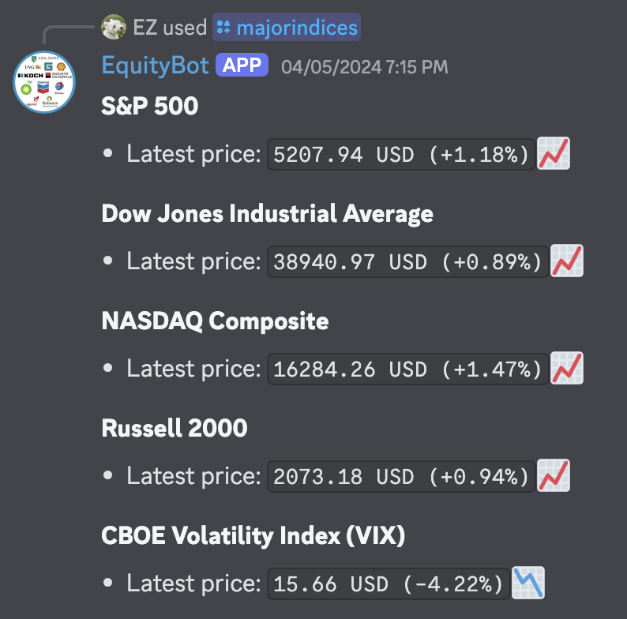
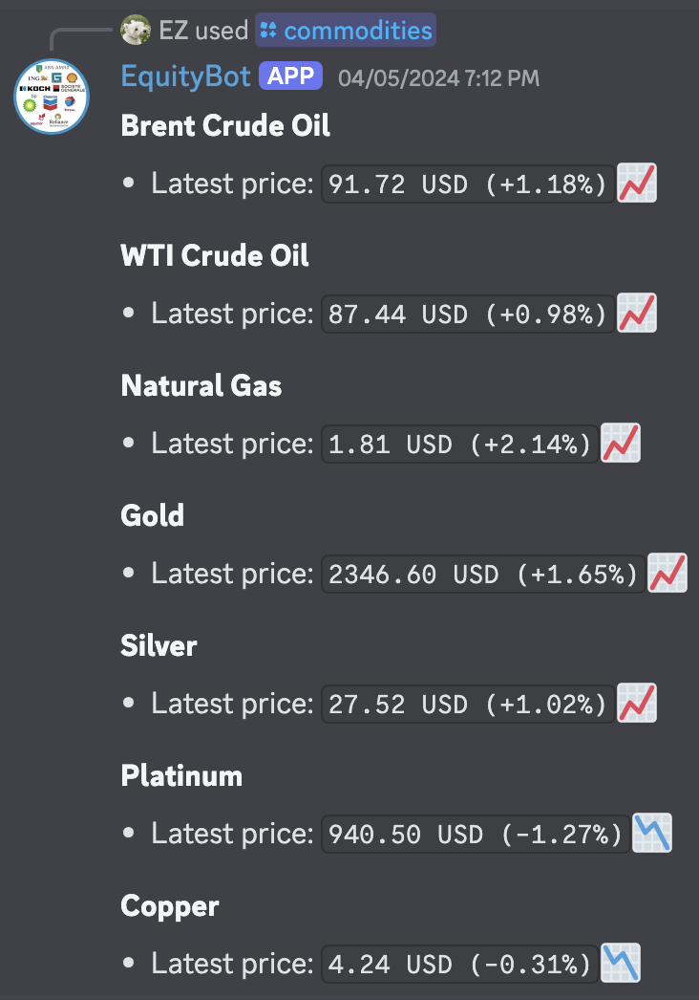

# equity-bot-discord
[](https://github.com/EtoileScintillante/equity-bot-discord/actions)  
Discord bot written in C++ with the [D++/DPP library](https://github.com/brainboxdotcc/DPP).  
It can fetch equity (stock/future/index) data and visualize it.  
All data is fetched from [Yahoo Finance](https://finance.yahoo.com).   
Important to note is that data may be delayed.

## Slash Commands (so far)
### /latestprice  
  - Fetches latest price data
  - Input: equity symbol


### /metrics  
  - Fetches equity metrics  
  - Input: equity symbol


### /majorindices
  - Fetches latest price data for certain major indices based on the given region  
    and optionally adds a short description (one sentence) about the indices  
  - Input: region (US/EU/Asia), description (yes/no)



### /commodities
  - Fetches latest price data for different commodities, such as Crude Oil and Gold



### /currencies
  - Fetches latest currency rates and US Dollar index


### /pricegraph 
  - Fetches price data and plots the open and/or close prices
  - Input: equity symbol, period (e.g. 6 months, 2 weeks, etc.), mode (only open/only close/both)


### /candlestick
  - Fetches OHLC data and creates a candlestick chart, optionally with volumes
  - Input: equity symbol, period (e.g. 6 months, 2 weeks, etc.), volume (yes/no)


## Building and Running the Bot (macOS) 
### Prerequisites

- [CMake](https://cmake.org) (version 3.5 or higher)
- C++ Compiler with C++17 support
- [Git](https://git-scm.com)
- Discord Bot Token (add this to a .config file)

### Instructions
1. Clone this Repository

    ```bash
    git clone https://github.com/EtoileScintillante/equity-bot-discord.git
    cd equity-bot-discord
    ```

2. Build the Bot

    ```bash
    mkdir build
    cd build
    cmake ..
    cmake --build .
    ```

3. Run the Bot

    ```bash
    ./equity-bot
    ```
